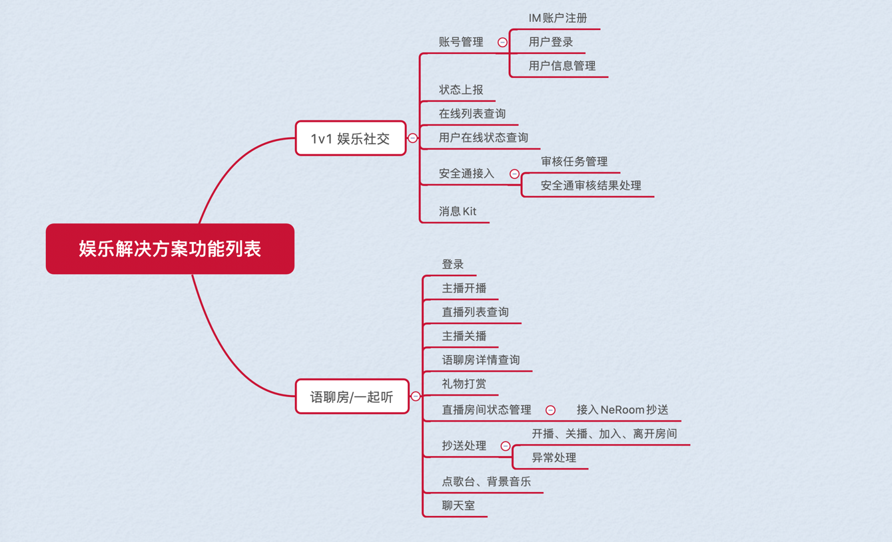
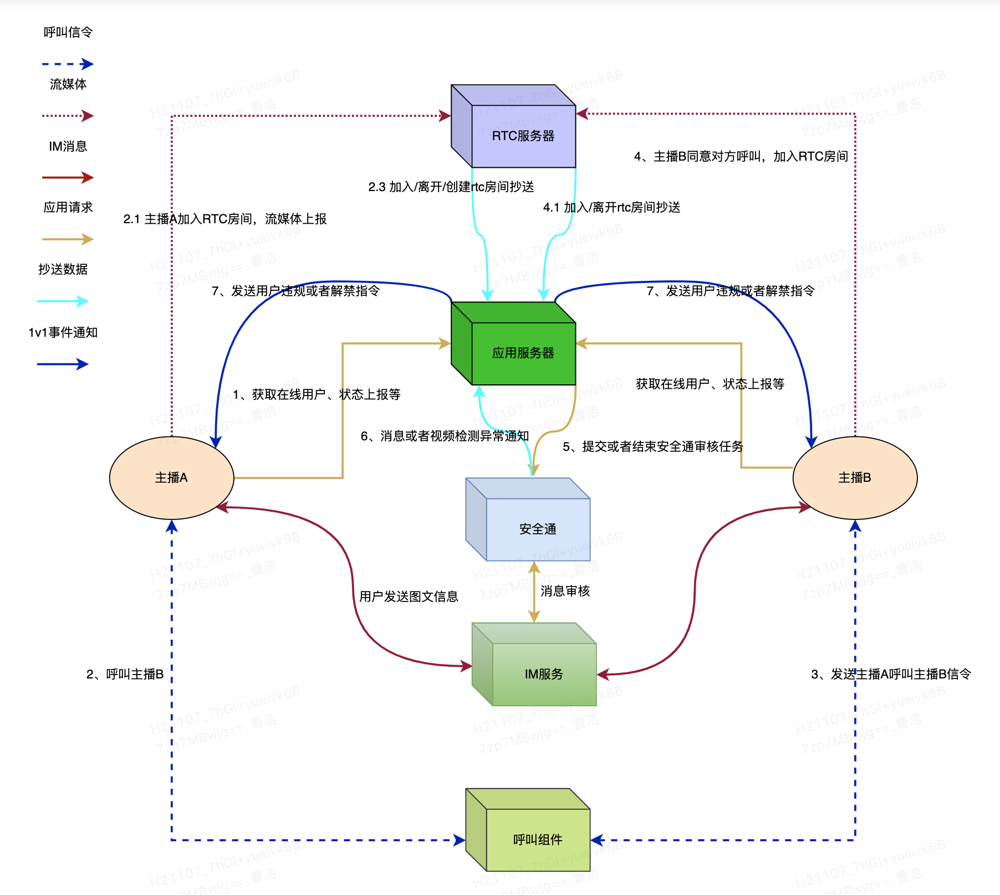
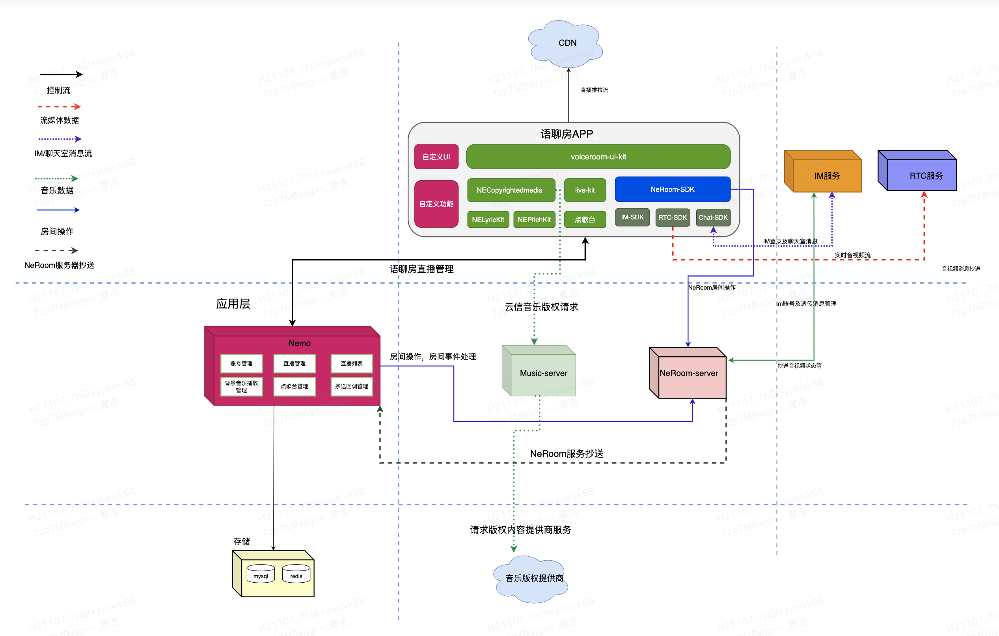

云信派对-服务器项目-Nemo
=========================
# Nemo简介
* Nemo是云信团队基于springboot开发的云信派对后端服务，包括云信娱乐社交1v1、云信娱乐语聊房等服务。
* Nemo提供了1v1娱乐社交在线用户列表维护、打赏、安全通审核等能力。
* Nemo基于云信NeRoom组件提供了语聊房主播开播、关播、直播列表、观众加入/离开语聊房、打赏等能力。
* Nemo封装云信IM、RTC、NeRoom等基础能力，配合开源的客户端源码可以快速搭建跑通1v1娱乐社交及语聊房业务。

## 2. 核心功能

### 2.1 1V1整体架构

### 2.2、语聊房整体架构

### 2.3 核心流程及协议
#### 2.3.1 1v1娱乐社交核心实现
[1v1娱乐社交核心实现](./doc/1v1娱乐社交核心实现.md)
#### 2.3.2 语聊房核心实现
[语聊房核心实现](./doc/语聊房/语聊房核心实现.md)
#### 2.3.3 语聊房协议
[语聊房协议](./doc/语聊房/语聊房协议.md)

## 3、Nemo工程介绍
### 3.1、Nemo工程模块介绍
* nemo-common 封装云信部分openAPI服务（IM/RTC/NeRoom等）及公共方法
* nemo-controller 云信派对服务器的API
* nemo-entlive-service 云信派对语聊房业务service
* nemo-socialchat-service 云信派对1v1娱乐社交的service
* nemo-user-service 云信派对用户服务

### 3.2、配置介绍
|  key | 描述 | value(Local示例)|
|  ----  | ----  | ----|
|  spring.profiles.active | 环境配置区分 | local |
|  spring.datasource.driver-class-name  | 数据库驱动  | com.mysql.cj.jdbc.Driver|
|  spring.datasource.type  | 指定数据源的实现类  | com.zaxxer.hikari.HikariDataSource|
|  spring.datasource.url  | mysql连接地址	  | jdbc:mysql://127.0.0.1:3306/nemo?useUnicode=true&characterEncoding=utf8&serverTimezone=Asia/Shanghai|
|  spring.datasource.username  | mysql用户名	  | nemo|
|  spring.datasource.password  | mysql密码	  | 123456|
|  spring.datasource.hikari  | 数据源连接池相关配置 | |
|  spring.redis.database  | database  | 0|
|  spring.redis.host  | redis地址  | 127.0.0.1|
|  spring.redis.port  | redis端口  | 6379|
|  yunxin.origin.appKey  | 云信appkey  | xxxx|
|  yunxin.origin.appSecret  | 云信appSecret  | xxxx|
|  yunxin.origin.nimHost  | 云信IM服务地址 国内默认: https://api.netease.im/  | https://api.netease.im/|
|  yunxin.origin.neRoomHost  | 云信NERoom服务地址 国内默认: https://roomkit.netease.im/  | https://roomkit.netease.im/|
|  yunxin.origin.securityAuditHost  | 云信安全通服务地址 国内默认: https://logic-dev.netease.im/  | https://logic-dev.netease.im/|
|  yunxin.origin.rtcHost  | 云信RTC服务地址 国内默认: https://logic-dev.netease.im/  | https://logic-dev.netease.im/|
|  business.yunxinAssistAccid  | 云信派对小助手  | yunxinassistaccid_1|
|  business.systemAccid  | 服务端系统Nim账号  | nimsystembot_1|
|  business.1v1RtcRoomLiveTime  | 单位（分钟） 1v1RTC房间存活时间，demo默认10分钟回收房间  | 10|
|  business.voiceRoomConfigId  | 语聊房模板ID  | 569|
|  business.roomOrderSongLimit  | 语聊房房间点歌数量限制  | 20|
### 3.3、数据库建表SQL
 [数据库建表SQL](data/mysql/init/init.sql)

## 4、项目源码地址
* 1v1娱乐社交客户端源码（Android&ios） https://github.com/netease-kit/1V1
* 语聊房客户端源码（Android&ios） https://github.com/netease-kit/NEChatroom
* 服务器源码 https://github.com/netease-kit/nemo
## 5.安装说明
 [安装说明——docker本地启动](./安装说明.md)

 [安装说明——IDEA本地启动](./Idea本地启动说明.md)
## 6.Demo体验

* 云信派对安卓下载包二维码 

* 云信派对ios下载包二维码

## 7. 联系我们
邮箱: 
caohao02@corp.netease.com, sanghuajun@corp.netease.com, niexiajun@corp.netease.com

