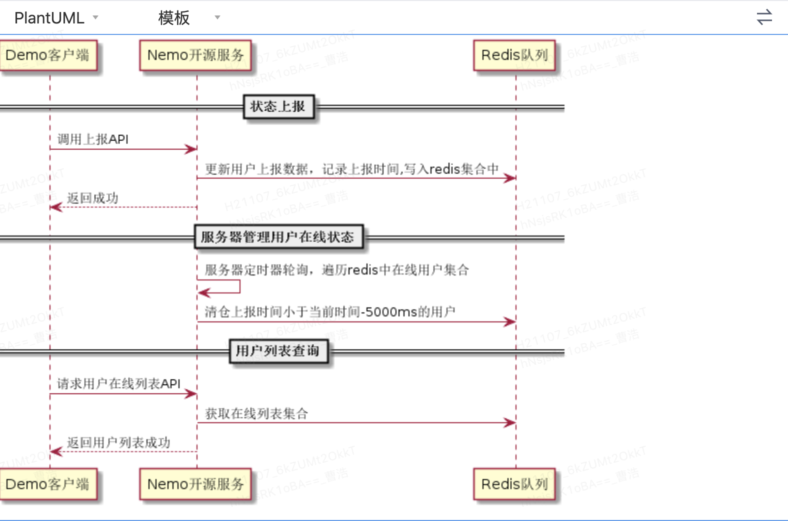
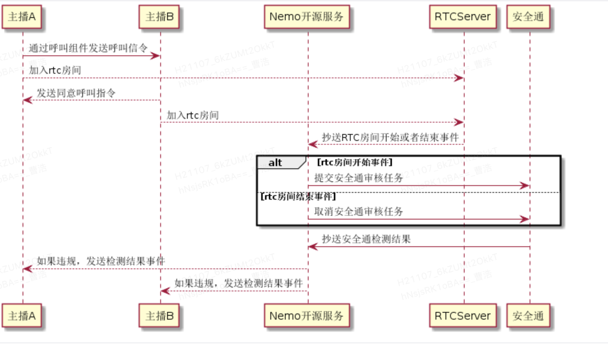
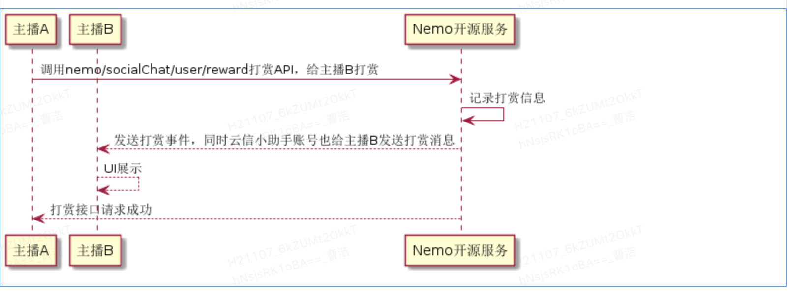

## 核心实现
### 1. 用户上报及列表查询

### 2. 1v1呼叫及通话流程

### 3. 1v1打赏

## 云信派对协议事件
#### 1. 1v1打赏协议（IM文本）
```json
{
    "type": 1004,
    "data":{
        "senderUserUuid": "88733061914566656",
        "sendTime": 1627289662000,
        "targetUserUuid": "88733061914566656",
        "targetUserName": "打赏者昵称",
        "giftId": 1,
        "cloudCoin":111,
        "giftCount":10,
        "rewardeeUserUuid": "88733061914566656",
        "rewardeeUserName": "打赏者昵称"    
    }
}
```
#### 2. 1v1打赏小秘书协议（IM自定义消息协议）
```json
{
    "type": 1007,
    "data":{
         "msg": "恭喜！您刚刚收到 连舟 赠送的礼物：爱的抱抱x1</br><a href="party://chat/p2pChat/user=">快去感谢TA吧～</a>"   
    }
}
```
#### 3. 安全通事件

（1）视频截图证据抄送信息
```json
{ 
        "data": { 
                "dataId": "370435748723511885531", 
                "callback": "", 
                "channelName": "bq032604", 
                "evidences": { 
                        "video": { 
                                "evidence": { 
                                        "uid": 2222, 
                                        "beginTime": 1616764739975, 
                                        "endTime": 1616764739975, 
                                        "type": 1, 
                                        "url": "https://****.jpg" 
                                }, 
                                "labels": [{ 
                                        "subLabels": [{ 
                                                "subLabel": 20001, 
                                                "rate": 1 
                                        }], 
                                        "level": 1, 
                                        "rate": 1, 
                                        "label": 200 
                                }] 
                        } 
                }, 
                "censorSource": 2, 
                "channelId": 43677571680222, 
                "taskId": "668335fe7adb4d9f88a", 
                "status": 101 
        }, 
        "type": 400 
}
```
（2）音频断句证据抄送信息
```json
{ 
    "data": { 
        "dataId": "370435748723511885531616758864450038930", 
        "callback": "", 
        "channelName": "bq032604", 
        "evidences": { 
            "audio": { 
                "uid": 1111, 
                "action": 2, 
                "startTime": 1616764308692, 
                "endTime": 1616764309532, 
                "asrStatus": 2, 
                "content": "控告广告", 
                "segments": [ 
                    { 
                        "subLabels": [ 
                            { 
                                "subLabel": "200009", 
                                "details": { 
                                    "evidence": "广告" 
                                } 
                            } 
                        ], 
                        "level": 2, 
                        "label": 200 
                    } 
                ] 
            } 
        }, 
        "censorSource": 2, 
        "channelId": 43677571680222, 
        "taskId": "668335fe7adb4d9f88ab35fb7b1e4b65", 
        "status": 101 
    }, 
    "type": 400 
}
```

（3）用户违规解禁事件
```json
{ 
    "data": { 
        "channelId": "111", 
        "channelName": "", 
        "uid": 111
    }, 
    "type": 3000 
}
```
