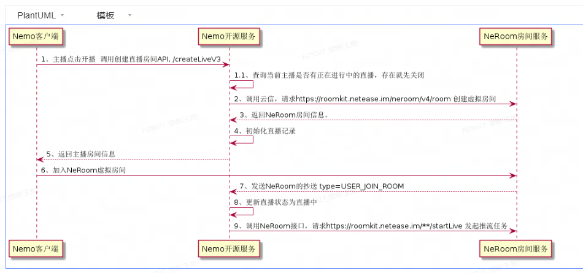
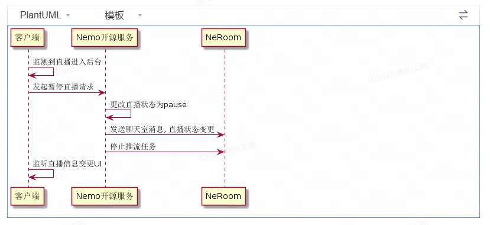
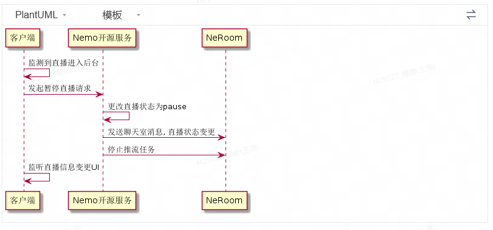
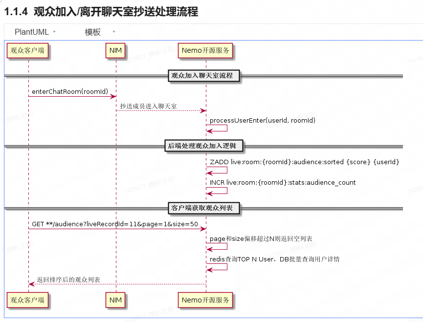
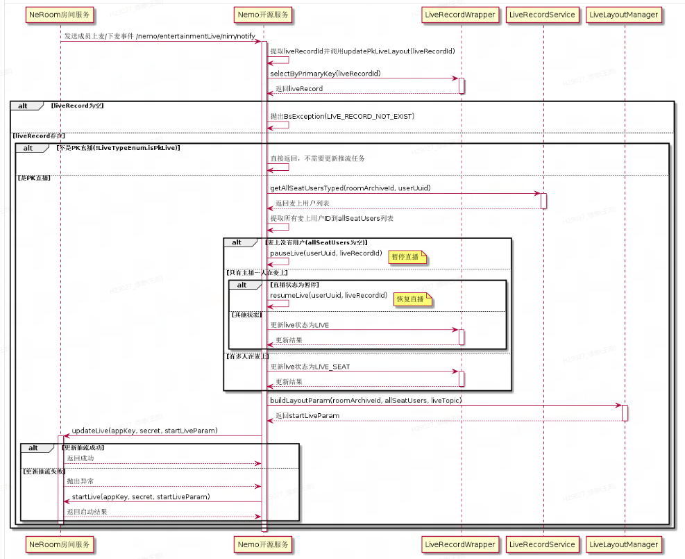

## 核心实现
### 1. 主播开播

### 2. 直播暂停

### 3. 直播恢复

### 4. 聊天室抄送处理流程

### 5. NeRoom抄送处理流程


## 云信派对协议事件
#### 1. 直播暂停（IM自定义消息协议）
```json
{
  "data": {
    "liveRecordId": 7570,
    "appKey": "3c576300158e8ad9f81963f318b87d3d",
    "roomUuid": "2d68ee21c38046d7b69e5c4908ad4d60",
    "roomName": "learn to rest, not to quit.",
    "roomArchiveId": "17639144",
    "userUuid": "435597097414144",
    "liveTopic": "learn to rest, not to quit.",
    "cover": "",
    "status": 1,
    "live": 6,
    "liveType": 4,
    "singMode": 0,
    "chatRoomId": 10996682779
  },
  "type": 1105
}

```
#### 2. 直播恢复（IM自定义消息协议）
```json
{
  "data": {
    "liveRecordId": 7570,
    "appKey": "3c576300158e8ad9f81963f318b87d3d",
    "roomUuid": "2d68ee21c38046d7b69e5c4908ad4d60",
    "roomName": "learn to rest, not to quit.",
    "roomArchiveId": "17639144",
    "userUuid": "435597097414144",
    "liveTopic": "learn to rest, not to quit.",
    "cover": "",
    "status": 1,
    "live": 1,
    "liveType": 4,
    "singMode": 0,
    "chatRoomId": 10996682779
  },
  "type": 1106
}

```
